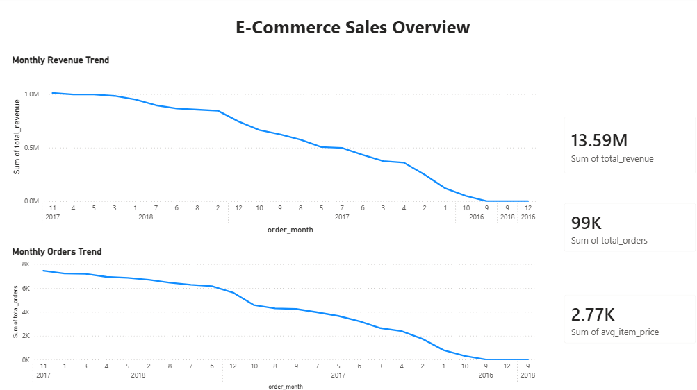
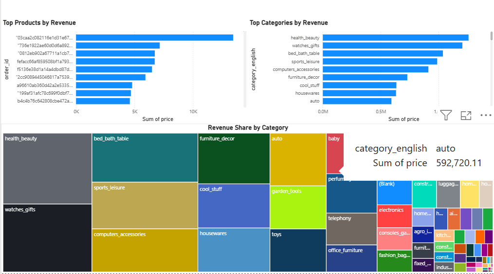
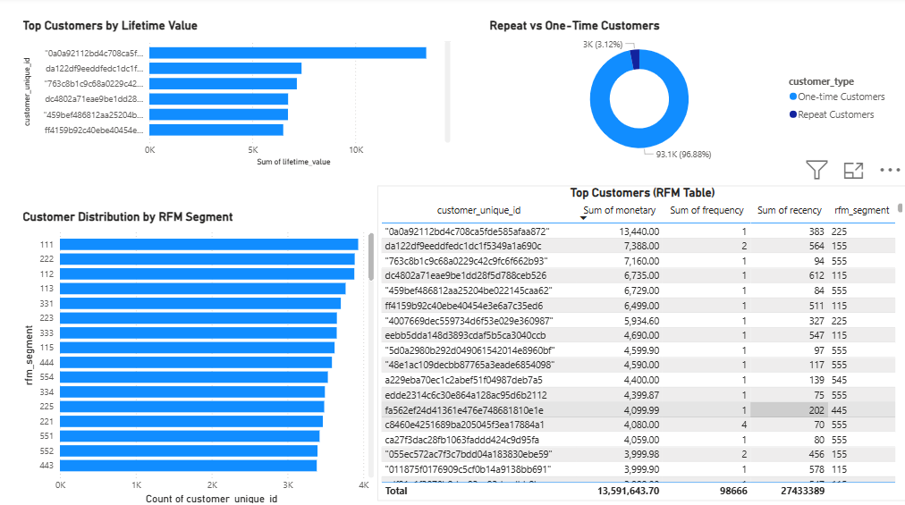

#  E-Commerce Sales & Customer Analytics Platform

*(SQL Server + Power BI)*

------------------------------------------------------------------------

##  Objective

Build an end-to-end analytics solution using real e-commerce data to
analyze:

-   Sales performance
-   Customer behavior
-   Retention & repeat purchases
-   Customer lifetime value (LTV)
-   Product & category performance

This project demonstrates a complete analytics workflow:

**Raw data ingestion → Cleaning → Analytics → Business insights →
BI-ready views → Dashboard**

It mirrors how analytics pipelines are built in real companies.

------------------------------------------------------------------------

##  Dataset

**Brazilian E-Commerce Public Dataset by Olist (Kaggle)**\
Real transactional e-commerce data.

-   \~100,000 orders
-   8+ CSV files
-   Covers customers, orders, products, sellers, payments, and reviews

### Files Used

-   `olist_customers_dataset.csv`
-   `olist_orders_dataset.csv`
-   `olist_order_items_dataset.csv`
-   `olist_order_payments_dataset.csv`
-   `olist_products_dataset.csv`
-   `olist_sellers_dataset.csv`
-   `olist_order_reviews_dataset.csv`
-   `product_category_name_translation.csv`
-   `olist_geolocation_dataset.csv` 

------------------------------------------------------------------------

##  Tech Stack

-   MS SQL Server
-   SQL
-   Data Modeling
-   Data Cleaning & Transformation
-   Business Analytics
-   Power BI
-   Kaggle Dataset

------------------------------------------------------------------------

##  Project Architecture

CSV Files (Kaggle)
↓\
Raw Tables (TEXT columns)
↓\
Clean Tables (Typed + Cleaned)
↓\
Analytics Tables (RFM, Cohorts)
↓\
Business Queries & Views
↓\
Power BI Dashboards & Insights

------------------------------------------------------------------------

##  Project Steps

### 1️⃣ Database Setup

-   Created project database: `EcommerceAnalytics`
-   Designed raw tables with all columns as `NVARCHAR`
    to handle messy real-world data safely

------------------------------------------------------------------------

### 2️⃣ Raw Data Ingestion

-   Loaded all CSV files using `BULK INSERT`
-   Handled:
    -   Encoding issues
    -   Truncation errors
    -   Type mismatches
-   Verified row counts matched source files

------------------------------------------------------------------------

### 3️⃣ Data Cleaning Layer

Created clean analytics tables using:

-   `TRY_CAST()`
-   Trimming (`LTRIM`, `RTRIM`)
-   Safe datetime conversions

Clean tables created:

-   `customers_clean`
-   `orders_clean`
-   `order_items_clean`
-   `payments_clean`
-   `products_clean`
-   `sellers_clean`
-   `reviews_clean`

Handled:

-   Invalid numeric values
-   Dirty ZIP codes
-   Broken timestamps
-   Text trimming & standardization

------------------------------------------------------------------------

### 4️⃣ Business KPIs & Analytics

Implemented core business metrics:

-   Total Orders
-   Total Revenue
-   Average Order Value (AOV)
-   Customer Lifetime Value (LTV)
-   Repeat vs One-time Customers
-   Monthly Revenue Trend
-   Top Products by Revenue
-   Top Categories by Revenue

------------------------------------------------------------------------

### 5️⃣ Advanced Analytics

#### 🔹 RFM Segmentation

Segmented customers based on:

-   **Recency** → Days since last purchase
-   **Frequency** → Number of orders
-   **Monetary** → Total spend

Implemented using `NTILE()` scoring.

Tables:

-   `rfm_base`
-   `rfm_scores`
-   `rfm_final`

------------------------------------------------------------------------

####  Cohort Analysis

-   Grouped customers by first purchase month
-   Tracked monthly retention behavior
-   Built cohort retention table

Tables:

-   `customer_cohorts`
-   `cohort_orders`
-   `cohort_analysis`

------------------------------------------------------------------------

### 6️⃣ BI-Ready Views

Created production-style SQL views for reporting:

-   `vw_sales_summary`
-   `vw_customer_ltv`

These views are used directly by Power BI dashboards.

------------------------------------------------------------------------

##  Key Insights

-   Identified top 10 products and categories by revenue
-   Discovered high-value customers using lifetime value (LTV)
-   Found that most customers are one-time buyers
-   Observed declining retention in later cohorts
-   Segmented VIP customers using RFM analysis

------------------------------------------------------------------------

##  Outcome

This project demonstrates:

-   Real-world data ingestion
-   Data cleaning & transformation
-   Business analytics
-   Customer segmentation
-   Retention analysis
-   BI-ready data modeling

It mirrors how analytics pipelines work in real companies.

------------------------------------------------------------------------

##  Repository Structure

    │── LICENSE
    │── README.md
    │
    ├── Dashboard/
    │   ├── customer_analytics.png
    │   ├── Ecommerce_Analytics_Dashboard.pbix
    │   ├── product_performance.png
    │   └── sales_overview.png
    │
    ├── data/
    │   ├── olist_customers_dataset.csv
    │   ├── olist_geolocation_dataset.csv
    │   ├── olist_orders_dataset.csv
    │   ├── olist_order_items_dataset.csv
    │   ├── olist_order_payments_dataset.csv
    │   ├── olist_order_reviews_dataset.csv
    │   ├── olist_products_dataset.csv
    │   ├── olist_sellers_dataset.csv
    │   └── product_category_name_translation.csv
    │
    ├── Insights/
    │   └── business_insights.md
    │
    └── sql/
        ├── 01_create_database.sql
        ├── 02_create_raw_tables.sql
        ├── 03_bulk_insert.sql
        ├── 04_clean_tables.sql
        ├── 05_business_queries.sql
        ├── 06_rfm_analysis.sql
        ├── 07_cohort_analysis.sql
        ├── 08_views.sql
        └── 09_geolocation_extension.sql

------------------------------------------------------------------------

##  Dashboard Preview

### Sales Overview

### Product Performance

### Customer Analytics

------------------------------------------------------------------------

##  Author

**Matthew Lawrence L**\
Aspiring Data Analyst \| Data Engineer \| Data Scientist

**Skills:**\
SQL · Data Analytics · Data Modeling · Power BI · Business Intelligence

------------------------------------------------------------------------

##  Summary

> I built an end-to-end e-commerce analytics platform using SQL Server
> and Power BI.\
> I ingested messy Kaggle data, cleaned it using SQL, built KPIs like
> revenue, AOV, and LTV, and implemented RFM segmentation and cohort
> analysis.
>
> I then created a 3-page Power BI dashboard showing sales trends,
> product performance, and customer analytics.
>
> This project mirrors a real analytics pipeline from raw data to
> business insights.
